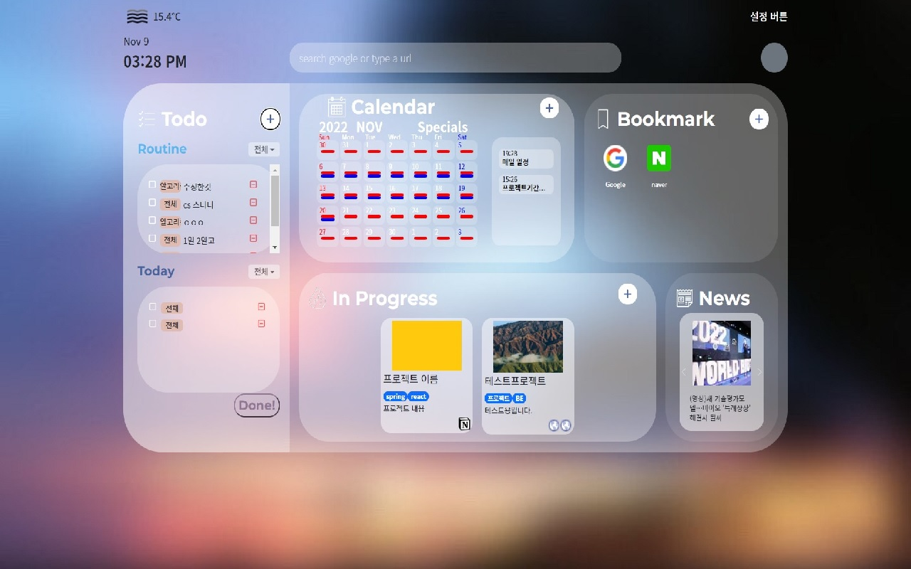
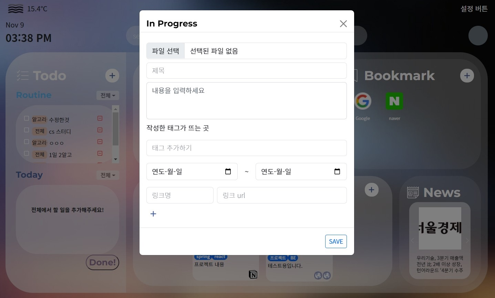
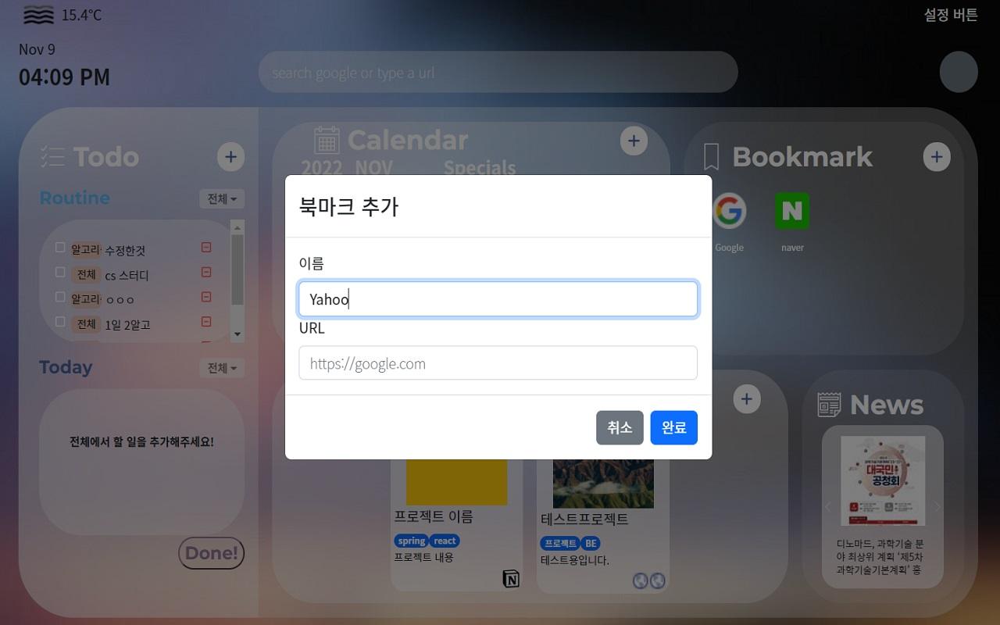
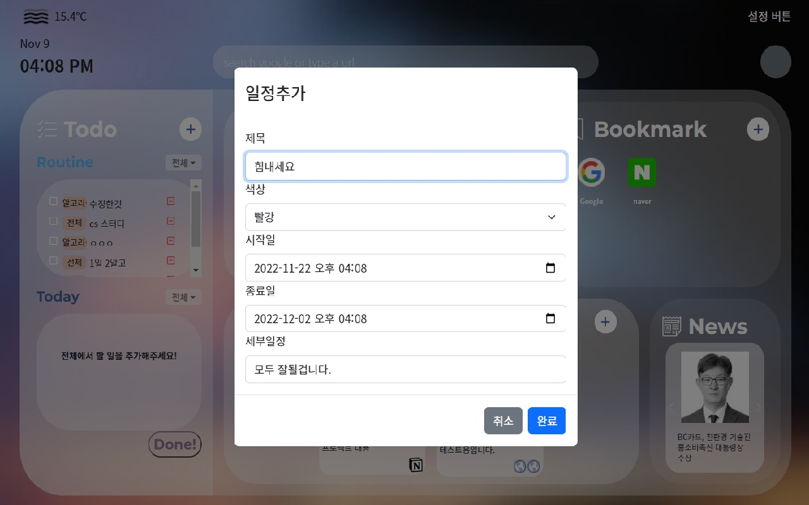
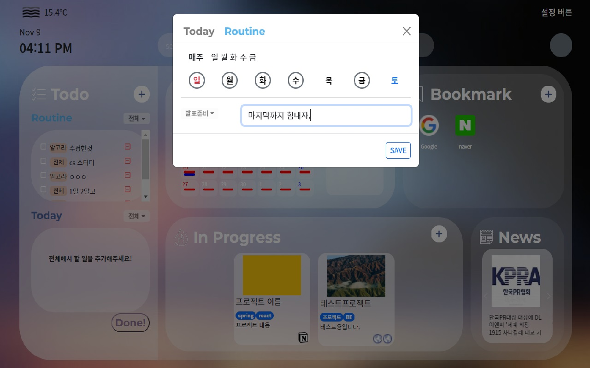

# **Haru Dashboard**

<center></center>

> 매일 다양한 스케쥴에 바쁜 당신을 위한 일정 관리 도구 Haru Dashboard
>
> 크롬 새 탭을 열 때마다 일정을 확인하여 매일의 목표를 달성하세요!

### **목차**

1. [Chrome Web Store](#crhome-web-store)

2. [Gitbook](#Gitbook)

3. [주요기능](#주요기능)

4. [세부기능](#세부기능)

5. [아키텍처](#아키텍처)

6. [설치 방법](#설치-방법)

7. [사용 예시](#사용-예시)

8. [개발 설정](#개발-설정)

9. [릴리즈 히스토리](#릴리즈-히스토리)

10. [기여](#기여)

11. [라이선스](#라이선스)

## **[Crhome Web Store](https://chrome.google.com/webstore/detail/haru-dashboard/hmpmbfiblaajjhlegnabeacbjodpkbkd?hl=ko)**

## **[Gitbook](https://haru-dashboard.gitbook.io/haru/)**

## :star:**주요기능**

---

## 👀한눈에 볼 수 있는 대시보드

크롬 새 탭에서 위젯들을 한눈에 확인하세요.

## 📅관리하기 편한 일정 및 Todo 리스트

매일 새로운 작업을 Todo에 적어보세요.

요일마다 반복되는 업무는 Routine기능을 이용하여 관리할 수 있어요.

## 🗃정리된 프로젝트

진행중인 프로젝트 또는 스터디를 등록하세요.

해당 프로젝트에 관련된 링크로 빠르게 이동할 수 있어요.

## :sparkles:**세부기능**

---

| 구분 | 기능         | 설명                                                        |
| ---- | ------------ | ----------------------------------------------------------- |
| 1    | 대시보드     | 크롬 새 탭을 열어서 위젯을 확인할 수 있습니다.              |
| 2    | 로그인 기능  | 로그인은 소셜로그인(구글)으로 진행됩니다.                   |
| 3    | Todo-Routine | 반복되는 Todo를 작성하고 관리할 수 있습니다.                |
| 4    | Todo-Today   | Todo를 작성하고 관리할 수 있습니다.                         |
| 5    | 일정관리     | 일정을 추가하고 관리할 수 있습니다.                         |
| 6    | 북마크       | 북마크를 추가하고 관리할 수 있습니다.                       |
| 7    | In Progress  | 진행중인 프로젝트, 스터디 등을 기록하고 확인할 수 있습니다. |
| 8    | 뉴스         | 최신 뉴스를 확인할 수 있습니다.                             |

## **아키텍처**

---

### 기술스택

- Frontend
  - Node.js: 16.16.0
  - React: 18.2.0
  - typescript: 4.8.4
  - webpack: 5.74.0
- Backend
  - Java: 11.0.16
  - Spring Boot: 2.5.2
  - MySQL
- Deploy
  - Docker
  - Nginx
  - Jenkins
- Server
  - EC2
  - S3

## **설치 방법**

---

- 일반사용자
  [Chrome Web Store](<[https://chrome.google.com/webstore/detail/haru-dashboard/hmpmbfiblaajjhlegnabeacbjodpkbkd](https://chrome.google.com/webstore/detail/haru-dashboard/hmpmbfiblaajjhlegnabeacbjodpkbkd)>)에서 설치
- 개발자용
  ```bash
  $ git clone https://github.com/Haru-Dashboard/Haru-Dashboard.git
  ```
  이후 개발 설정 참고

## **사용 예시**

---

1. 대시보드
   

2. In Progress
   

3. 북마크
   

4. 일정관리
   
5. Todo-Routine
   

## **개발 설정**

---

### 프론트엔드

```bash
# 프론트엔드 빌드
$ cd frontend/
$ npm install
$ touch .env
$ npm run build

# dist 폴더 업로드
# 새 탭을 열었을 때 대시보드가 보이면 성공
```

### 확장프로그램 폴더 업로드하기

(https://developer.chrome.com/docs/extensions/mv3/getstarted/development-basics/#load-unpacked)

- open Chrome and go to `chrome://extensions/`,
- enable "Developer mode",
- click "Load unpacked extension",
- select the `dist` folder in this repo.

```bash
# watch 모드로 개발
$ npm run watch
```

### **Optional**

1. .env

   ```
   # OpenWeather API (https://openweathermap.org/api)
   REACT_APP_WEATHER_API_KEY=
   # Bing News API (https://learn.microsoft.com/en-us/bing/search-apis/bing-news-search/overview)
   REACT_APP_MSEdgeKey=
   # Backend URL
   REACT_APP_BACKURL=
   ```

1. 환경설정

   마켓플레이스에서 [`eslint`](<[https://marketplace.visualstudio.com/items?itemName=dbaeumer.vscode-eslint](https://marketplace.visualstudio.com/items?itemName=dbaeumer.vscode-eslint)>), [`prettier`](<[https://marketplace.visualstudio.com/items?itemName=esbenp.prettier-vscode](https://marketplace.visualstudio.com/items?itemName=esbenp.prettier-vscode)>) 설치

### 백엔드

1. application.aws.yml

   ```yaml
   cloud:
     aws:
       credentials:
         access-key: // your key
         secret-key: // your key
       s3:
         bucket: // your bucket
         public-url: // your public-url
       region:
         static: ap-northeast-2
       stack:
         auto: "false"
   spring:
     servlet:
       multipart:
         max-request-size: 20MB
         max-file-size: 20MB
   ```

2. application-secret.yml

   ```yaml
   # Google
   spring:
     security:
       oauth2:
         client:
           registration:
             google:
               client-id: // your id
               client-secret: //
               redirect-uri: "{baseUrl}/oauth2/code/{registrationId}"
               scope:
                 - email
                 - profile

   app:
     auth:
       token:
         secret-key: // your key
         refresh-cookie-key: "refreshToken"
   ```

## Deployment

- [Gitbook](https://haru-dashboard.gitbook.io/haru/guides/deployment)

## **릴리즈 히스토리**

---

See [Changelog](https://www.notion.so/Changelog-md-5b21a76191734dc2b25dbfb94e7244a1)

## **기여**

---

See [Contributing](https://www.notion.so/Contributing-bd82a8b705464db981a8776837deb362)

## **라이선스**

---

Distributed under the SGPL license. See [License](https://github.com/Haru-Dashboard/Haru-Dashboard/blob/develop/LICENSE) for more information.
